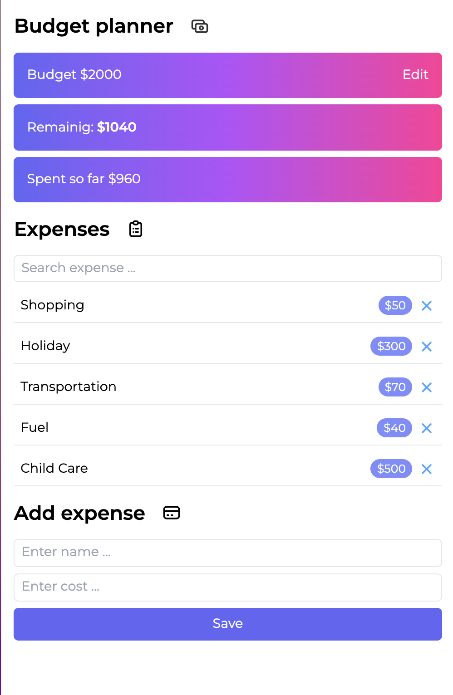

## This is my page for homework№4
Kindly find some a description about attached file:
1. The main file index.html which shows the page. [press here to view](https://dianakorotchenko.github.io/Simple-Budget-App/)

---
I have used knowledge of Bootstrap - the most popular CSS Framework for developing responsive and mobile-first websites to create this page. 
Firstly I have devided all page on blocks and have applied flex utility and grid layout to make a responsive page.
Kindly find a preview below:  
